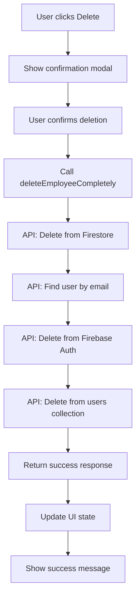

# Employee Deletion System Guide

This guide explains how the employee deletion system works, ensuring that when an employee is deleted, both their database record and Firebase authentication account are removed.

## Overview

The employee deletion system provides complete removal of employee data from:
1. **Firestore Database** - Employee document in the `employees` collection
2. **Firebase Authentication** - User account in Firebase Auth
3. **Users Collection** - User document in the `users` collection (if exists)

## How It Works

### 1. API Route (`/api/delete-employee`)

The main deletion logic is handled by the API route that:
- Deletes the employee document from Firestore
- Finds and deletes the Firebase Auth account by email
- Removes any associated user documents from the `users` collection
- Provides detailed logging and error handling

```javascript
// API Route: src/app/api/delete-employee/route.js
export async function DELETE(request) {
  // 1. Delete from Firestore employees collection
  // 2. Delete from Firebase Authentication
  // 3. Delete from users collection (if exists)
  // 4. Return success/error response
}
```

### 2. Utility Functions (`src/app/lib/employeeUtils.js`)

Helper functions for employee deletion:

```javascript
// Delete employee completely
const result = await deleteEmployeeCompletely(employeeId, employeeEmail);

// Check if employee has auth account
const hasAccount = await checkEmployeeAuthAccount(email);

// Get formatted messages
const message = getEmployeeDeletionMessage(employee);
const successMessage = getEmployeeDeletionSuccessMessage(employee);
```

### 3. EmployeeList Component Integration

The EmployeeList component uses the deletion system:

```javascript
const confirmDeleteEmployee = async () => {
  const result = await deleteEmployeeCompletely(
    employeeToDelete.id, 
    employeeToDelete.email
  );
  
  if (result.success) {
    // Update UI and show success message
  }
};
```

## Deletion Process Flow



## What Gets Deleted

### ✅ Employee Record (Firestore)
- Document in `employees` collection
- All employee data (name, email, position, etc.)

### ✅ Authentication Account (Firebase Auth)
- User account identified by email
- Authentication credentials
- User metadata

### ✅ User Document (Firestore)
- Document in `users` collection (if exists)
- User role and permissions data

## Error Handling

The system handles various error scenarios:

1. **Firestore deletion fails** - Returns error, stops process
2. **Auth account not found** - Logs warning, continues
3. **Auth deletion fails** - Logs error, continues (employee record already deleted)
4. **Users collection deletion fails** - Logs error, continues

## Security Considerations

### ✅ Server-Side Deletion
- All deletion operations happen on the server
- Uses Firebase Admin SDK for secure operations
- Client cannot bypass authentication checks

### ✅ Permission-Based Access
- Only users with `EMPLOYEE_DELETE` permission can delete
- Protected by PermissionGuard component
- Role-based access control enforced

### ✅ Confirmation Required
- User must confirm deletion in modal
- Clear warning about permanent deletion
- Shows what will be deleted

## Usage Examples

### Basic Employee Deletion

```javascript
import { deleteEmployeeCompletely } from '../../../lib/employeeUtils';

const handleDelete = async (employee) => {
  const result = await deleteEmployeeCompletely(
    employee.id, 
    employee.email
  );
  
  if (result.success) {
    console.log('Employee deleted successfully');
  } else {
    console.error('Deletion failed:', result.error);
  }
};
```

### Check if Employee Has Auth Account

```javascript
import { checkEmployeeAuthAccount } from '../../../lib/employeeUtils';

const checkAccount = async (email) => {
  const hasAccount = await checkEmployeeAuthAccount(email);
  console.log('Has auth account:', hasAccount);
};
```

### Custom Deletion with Confirmation

```javascript
const handleDeleteWithConfirmation = async (employee) => {
  const confirmed = window.confirm(
    getEmployeeDeletionMessage(employee)
  );
  
  if (confirmed) {
    const result = await deleteEmployeeCompletely(
      employee.id, 
      employee.email
    );
    
    if (result.success) {
      alert(getEmployeeDeletionSuccessMessage(employee));
    }
  }
};
```

## Testing the Deletion System

### 1. Create Test Employee
- Add a new employee with email
- Ensure they have a Firebase Auth account

### 2. Test Deletion
- Navigate to Employee List
- Click Delete on the test employee
- Confirm deletion in modal
- Verify employee is removed from list

### 3. Verify Complete Deletion
- Check Firestore: Employee document should be gone
- Check Firebase Auth: User account should be deleted
- Check Users collection: User document should be removed

## Troubleshooting

### Common Issues

1. **"Firebase Admin not initialized"**
   - Check environment variables
   - Verify Firebase Admin configuration

2. **"User not found in Firebase Authentication"**
   - Employee may not have had an auth account
   - This is normal for employees without login access

3. **"Failed to delete employee record"**
   - Check Firestore permissions
   - Verify employee document exists

### Debug Tips

```javascript
// Enable detailed logging
console.log('Deleting employee:', { id, email });

// Check API response
const response = await fetch('/api/delete-employee', {
  method: 'DELETE',
  body: JSON.stringify({ employeeId: id, employeeEmail: email })
});
const result = await response.json();
console.log('Deletion result:', result);
```

## Best Practices

1. **Always confirm deletion** - Use confirmation modals
2. **Show clear messages** - Inform users what will be deleted
3. **Handle errors gracefully** - Provide meaningful error messages
4. **Log operations** - Keep audit trail of deletions
5. **Test thoroughly** - Verify complete deletion in all systems

## Security Notes

- ⚠️ **Client-side permissions are for UX only**
- ✅ **Server-side validation is enforced**
- ✅ **Firebase Admin SDK provides secure deletion**
- ✅ **All operations are logged for audit**

## Related Files

- `src/app/api/delete-employee/route.js` - Main deletion API
- `src/app/api/check-user-auth/route.js` - Check auth account API
- `src/app/lib/employeeUtils.js` - Utility functions
- `src/app/components/hrui/employeesrecordmodal/EmployeeList.jsx` - UI component
- `src/app/lib/firebaseAdmin.js` - Firebase Admin configuration
